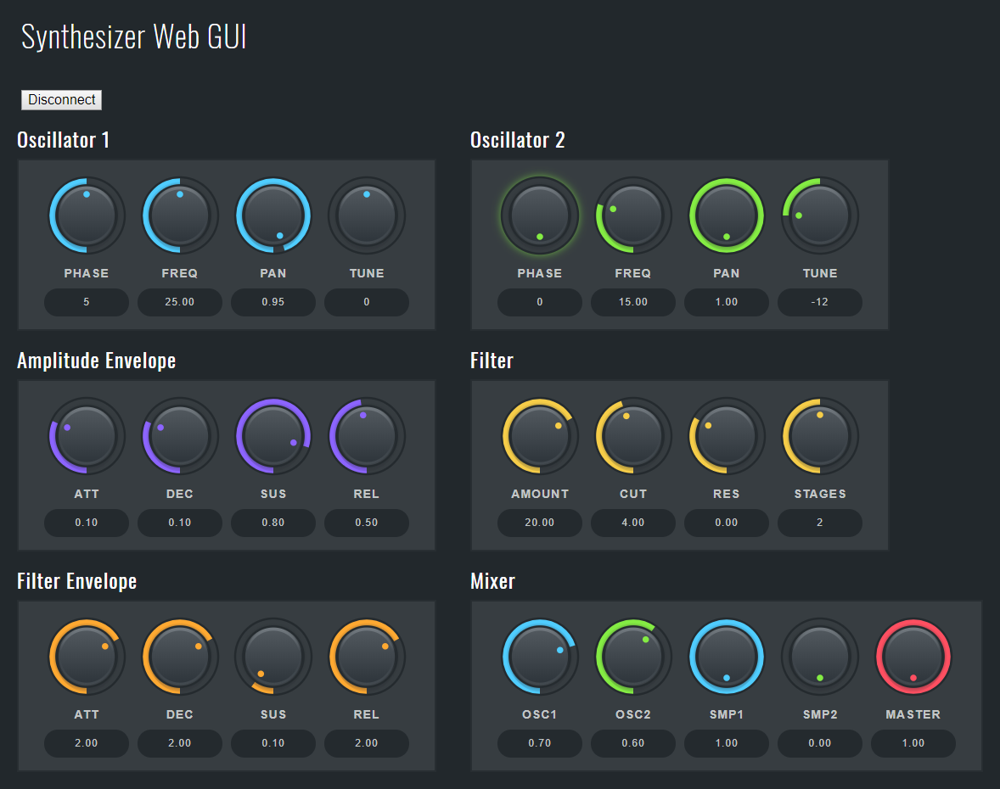

# WebGUI

## Running the Server

In order to run the server, you'll need to:

1. Compile the DSP server
2. Build the server front-end assets
3. Run the server with `websocketd`

### 1. Compile the DSP Server

Build one of the solutions in the [DSPServer folder](../DSPServer). If you're not sure which, start with at least the Debug build of `ServerSynth1`.

### 2. Build Front-End GUI

The front-end GUI is built with a Node-based task runner called `gulp`. You can see `gulpfile.js` in this directory if you're interested in the details.

In order to build the GUI assets:

- Download/Install the [Node runtime](https://nodejs.org/en/) if you don't already have it available
- Open this directory in a terminal
- Run `npm install` to fetch our Node dependencies (`npm` is installed with the Node runtime)
- *Build the assets with `npm run build`
- Find the built assets in the `build/` directory

*Note that `npm run build` executes the `gulp deploy` task. If you would prefer to run those tasks more directly, you can install the `gulp` CLI globally with `npm install -g gulp` and then `gulp build`, `gulp watch`, `gulp deploy`, etc as appropriate.

### 3. Run the Server

Obtain a copy of the pre-compiled binary `websocketd` executable for your platform from [websocketd.com](http://websocketd.com/) (or [get the source from GitHub](https://github.com/joewalnes/websocketd) and build it yourself), and put the executable in this folder.

Then run `websocketd` as follows (this is for Windows; other platforms will be very similar):

```
websocketd --port 8080 --staticdir=build ..\DSPServer\x64\Debug\ServerSynth1.exe
```

- `--port 8080` sets the port on which `websocketd` will listen. Change if you wish.
- `--staticdir=build` defines this directory for our front-end GUI assets.
- The rest of the command is the relative path to the DSP Server executable.

### Success!

Point a web browser at *http://localhost:8080/synth1/* and you should see the web GUI for the synthesizer implemented in `ServerSynth1`. (Substitute your PC's numeric IP address for "localhost" if your browser is running on a different machine.) Note you must click the **Connect** button to actually run the `ServerSynth1` executable, and you should remember to click it again to shut it down when you're done.

Run any suitable version of the **NetSynth plug-in** ([download from here](http://netvst.org/wiki/doku.php?id=downloading_and_using_netvst), where you'll also find detailed usage instructions) in your favorite DAW, and connect it to port 27016 on your PC. You should then be able to play and record the synthesizer.

Adjust the knobs in the web GUI, and you should hear the corresponding sound changes.



## Plans for the web-GUI code

In the long run I'd like to see a fairly complete set of web-hosted audio controls, which look nice both individually and in combination, as well as a variety of example web GUIs showing how to assemble them in groups. (With luck, the PaintCode files from the [AudioKitGraphics repo](https://github.com/AudioKit/AudioKitGraphics) may be directly usable. Fingers crossed!)
