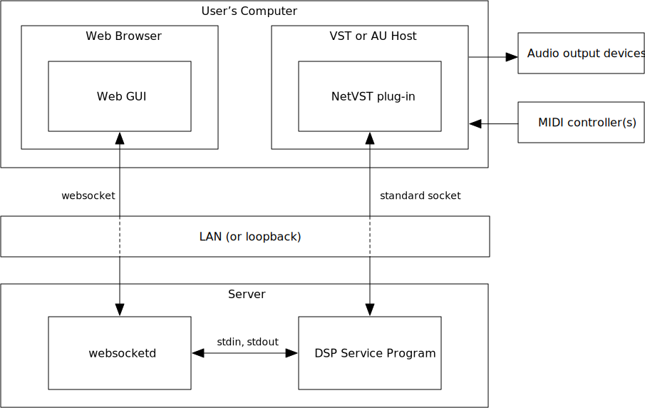

# A network-based audio plug-in interface standard
ALL successful audio plug-in formats are 100% proprietary. The companies involved have a long history of actively refusing to cooperate, and causing major headaches for developers. The network-based techniques used in AudioKit-net have some potential to become a fully open, cross-platform plug-in standard, based entirely on open, standard network protocols.

## Issues with existing plug-in systems
There are quite a few *de facto* "standards" for audio plug-ins. Have a look at [this Wikipedia page](https://en.wikipedia.org/wiki/Audio_plug-in), and scroll down to the table under the heading "List of plug-in architectures". Out of 10 standards listed there:
- 6 are fully proprietary, including the most widely-used by far (VST, AU, AAX)
- 3 are essentially obsolete (Avid RTAS and TDM have been supplanted by AAX, LADSPA by LV2)
- 1 is not cross-platform at all (DirectX plugins)
- The rest are technically cross-platform, but almost entirely used on Linux

The most widely-used plug-in standards are VST (Steinberg: Cubase), AU (Apple: Logic Pro, GarageBand), and AAX (Avid: ProTools). The associated vendors' enormous market power is the only reason all three continue to exist, at considerable cost to plug-in developers.

The fact that plug-ins are typically loaded *in-process* into their host programs means that there are actually multiple incompatible variants of each standard, e.g. VSTs compiled for Windows, macOS, and Linux are incompatible, as are 32- and 64-bit VSTs on a given platform.

## Cross-standard technologies
The few technical differences among the dominant plug-in standards are meaningless in practice, and it is entirely possible to use software to adapt one to another. There are three basic approaches:
1. One can create a plug-in based on standard *X*, which acts as a host for plug-ins based on standard *Y*. This is the approach used by [jBridge](https://jstuff.wordpress.com/), [Metaplugin](https://ddmf.eu/metaplugin-chainer-vst-au-rtas-aax-wrapper/), and several other products. Simplistic implementation would require a two-stage loading process (load the bridge plug-in in the DAW, then load the target plug-in inside it), but this can be effectively hidden with careful programming.
2. One can create a plug-in based on standard *X*, which sends audio/MIDI/control data to and from a separate application, which acts as a host for *Y*-type plug-ins. If the data communication can work over a LAN, the host application may run on a different computer. This is the approach used by [Vienna Ensemble Pro](https://www.vsl.co.at/en/Vienna_Software_Package/Vienna_Ensemble_PRO), [NetVST](http://netvst.org/wiki), and [DAWconnect](https://www.dawconnect.com/).
3. One can use a software library such as [JUCE](https://www.juce.com), which allows writing DSP and GUI code based on its own (proprietary) APIs, and compiling multiple versions of the resulting plug-in for multiple standards.

The 32/64-bit problem requires that solutions of method 1 above are actually implemented with method 2. JUCE is essentially an automated technique for method 1, which is used by a great many newer/smaller plug-in developers. Larger, established companies have in-house code libraries which provide similar benefits.

The key similarity among all these approaches (with NetVST as the only exception), is that they all involve *proprietary APIs*, resulting in *vendor lock-in*.

## NetVST: a step in the right direction
The [NetVST project](http://netvst.org/wiki) was an application of method 2 in the list above, which allowed VST 2.x plug-ins to be accessed (either locally or across a LAN) by both macOS and Windows DAWs. It consisted of a VST 2.x host program for Windows (both 32-bit and 64-bit builds), capable of receiving/transmitting MIDI, audio, and control data via a TCP/IP network socket, plus both AU and VST 2.x plug-ins (again 32- and 64-bit) capable of connecting to that socket. Because socket connections can be made between different processes on a single computer (using the virtual *loopback* network interface), use of an actual LAN is optional.

The NetVST software has been used mainly as a way to extend the usefulness of older, 32-bit-only Windows VST 2.x plug-ins (of which there are thousands, nearly all free). Although it works well, it has two serious limitations:
1. It is NOT open-source (see [NetVST_Windows/README.md](NetVST_Windows/README.md) for the reasons).
2. It has no mechanism to present a bridged plug-in's GUI on the same screen as the host DAW. That is, it provides bridging of the DSP aspects of plug-ins, not the GUI aspects.

Despite these liminations, the various NetVST plug-ins, which effectively allow any compatible DAW to connect to a networked DSP service process (*daemon*), are highly useful tools to support development of a new and fully open network plug-in standard.

## AudioKit-net: adding support for remote GUI
In AudioKit-net, the essential code of the NetVST plug-ins is made open-source. (Fully open source isn't possible, due to the use of proprietary plug-in APIs, but the *essential* socket-communication code is published here.) Furthermore, a fully open-source implementation of the remote DSP side of the communication protocol is provided. Thus, the DSP aspect of an open standard is addressed.

To allow the GUI to be presented on a different machine from the one where the DSP code is executed, the natural and obvious open-standard approach is to use web technologies. For some time, it has been possible to use a mix of HTML, CSS, SVG and JavaScript to create GUIs featuring typical audio controls such as knobs, but the "hard part" is real-time communication with the server-side process.

The well-established [AJAX](https://en.wikipedia.org/wiki/Ajax_(programming)) programming technique could in theory be used, but this would require the server-side process be able to understand HTTP and effectively function as a web server. This is obviously complex, and also very inefficient.

Widespread support for the [WebSocket protocol](https://en.wikipedia.org/wiki/WebSocket) in modern browsers provides for more efficient communication between the JavaScript running a web GUI and server-side code, which then need not implement the full HTTP protocol, but rather the much simpler WebSocket protocol. However, this is still a substantial burden.

This burden is effectively eliminated by the excellent [websocketd](http://websocketd.com/) program, which can act as both a HTTP and a WebSocket server, delegating all communication over an open WebSocket to a very simple service process, which need only read incoming messages from `stdin` and write output messages to `stdout`. This is the approach used in AudioKit-net. Note that websocketd is free, open-source (BSD-2 license), and available for Windows, macOS, Linux, Solaris, FreeBSD and OpenBSD.

## Anatomy of an AudioKit-net setup
The following diagram shows the structure of a typical AudioKit-net setup, involving two separate computers--the User's (musician's) computer and a "server"--connected by a LAN.

The "server" can be any type of computer capable of communicating via TCP/IP with low latency. If the operating system supports it, the server can run "headless", i.e., with no screen, keyboard, or mouse; it may simply be one of many such machines in a rack.

The server runs the *websocketd* daemon, which awaits connections on some TCP/IP port, and is configured to spawn an instance of the chosen DSP Service Program when a connection is made. The DSP service program receives messages via its standard input and responds via its standard output; a typical message might be "ampAttack=1.25" to set the amplitude attack-time of synthesis algorithm to 1.25 seconds. The DSP service program also listens for connections on a *different TCP/IP port*, over which it will exchange audio, MIDI, and parameter data via the (binary) NetVST protocol. Hence the DSP service program is effectively the "synthesizer" in this setup.

The user's computer will typically be a workstation-type machine (or possibly a tablet) whose operating system provides support for low-latency audio-output devices, MIDI controllers, and a full user interface e.g. screen/mouse/keyboard, touch screen etc. This computer runs some kind of plug-in host program or DAW, capable of routing MIDI input to plug-ins and sending the resulting audio out to the output devices. The *NetSynth* plug-in is used; it connects to the DSP service program's binary NetVST port.

At the same time, the user's computer also runs an ordinary web browser, which connects to the port on which the *websocketd* daemon is listening. Because *websocketd* can act as a HTTP server, it serves the HTML, CSS, and JavaScript files required to present a suitable GUI for the synthesizer functions of the DSP service program. The JavaScript which powers this GUI makes a WebSocket connection, and is then able to send and receive control messages to the DSP service program's standard input/output. Adjusting a control, e.g., a knob, causes appropriate messages to be sent, to adjust DSP parameters.

## Possible variations
The basic setup shown in the previous diagram can be modified to achieve any of the following variations:
- **Single-computer setup:** The user's computer can optionally run the *websocketd* and DSP service programs, in effect acting as a server. In this case, the computer's "loopback" virtual network device is used, and no physical LAN is required.
- **Web GUI in plug-in:** The NetVST plug-ins do provide a custom GUI inside the host DAW, but as of this writing, this consists only of input fields for the target IP address and port. There is no reason why this should not be expanded to include some kind of embedded web-browser widget. There would then be no need for a separate web browser, and the user's experience would be very similar to using a conventional plug-in.
- **Native GUI in plug-in:** For commercial use, the plug-in could be further customized with a full custom GUI (just like any other type of plug-in) which just happens to work by communicating over the NetVST socket to a DSP service on the server.
- **Local/remote DSP option:** Once the plug-in features a full native GUI, it is just one more step to give it a local copy of the DSP code, and a check-box to select whether to execute locally or over the network. This effectively makes the server an [optional hardware accelerator](network-accel.md).

One thing should be noted about the "web GUI in plug-in" approach. A plug-in that simply has an embedded web browser to contain a GUI, which is itself defined by whatever HTML/CSS/JavaScript the server sends, would be highly generic. A DAW vendor might choose to include such a plug-in as a standard part of the DAW package, or even build the necessary code right into the DAW itself. At this point, no separate plug-in would even be necessary, and one could say that the two-socket network system described above indeed constitutes a new, cross-platform, standards-compliant plug-in interface standard.
